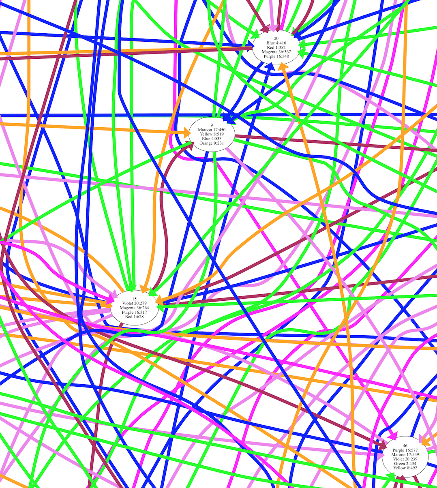

# The #586 and #596 nightmare

This challenge was madness because it was very hard to detect loops in a computationally efficient way. Particularly, submit cases #586 y #596 exploded in millions of paths each one with thousands of possible exit colors.

I used a conservative branch and bound approach where paths are pruned if a) we arrive at a galaxy with a subset of the primary colors of a previous visit AND b) our cost is worse than the previous visit’s cost. That worked well for every case except 586 and 596 because it's computationally expensive to check the visit log evertime.

For those cases I had to add a heuristic decision: prune the path if the aggregated cost so far is greater than 20000. In heavily connected graphs, such as those of #586 and #596 this should be an acceptable approach.

Also, it’s very easy to plot parsed data using graphviz, which helps in debugging the easiest cases. Not so for the complex ones like graph-214.png :)

