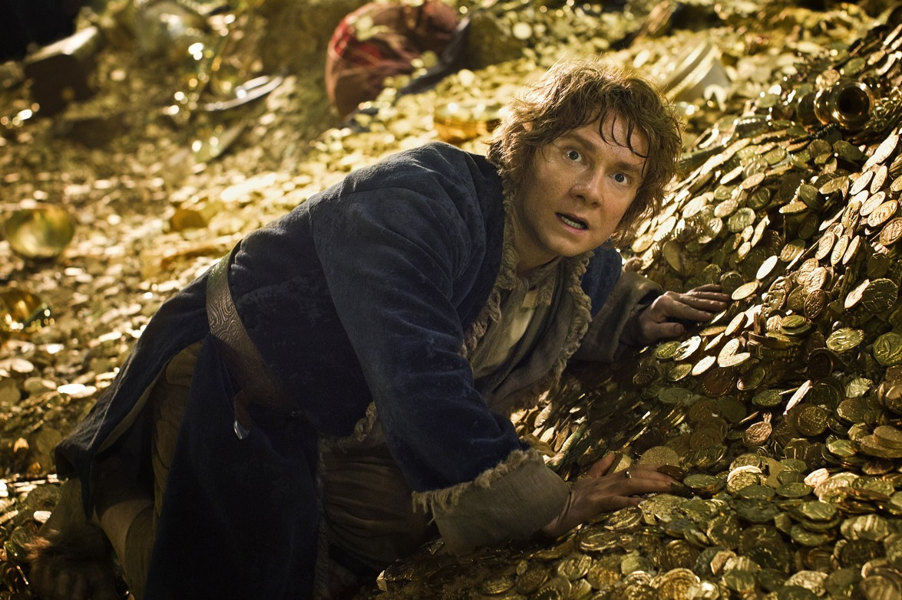
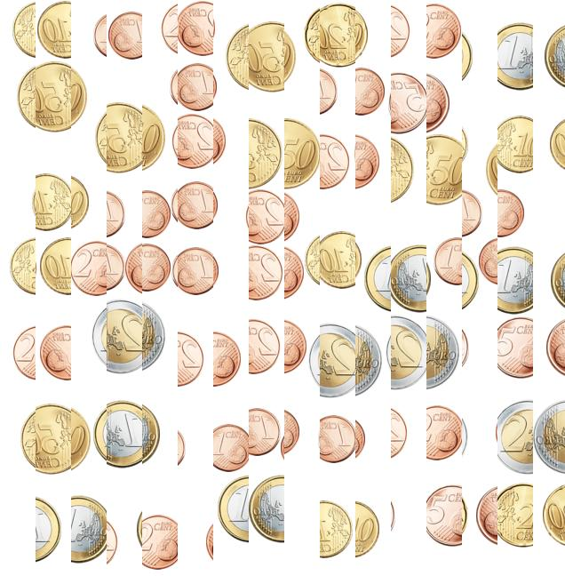
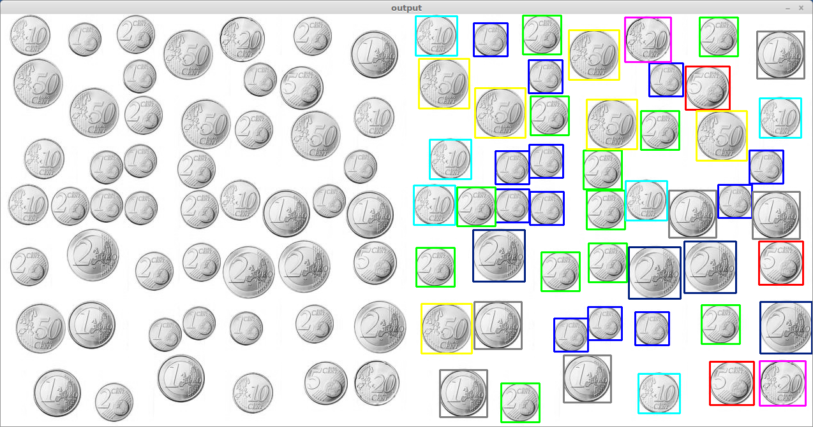

# OpenCV black magic

To be honest, I was expecting all sorts of complications such as rotated, resized or even overlapped coins in this one after my experience with #11, but this turned out much simpler than I though thanks to OpenCV and their template matching algorithms, which worked incredibly well and efficiently.

Besides the difficulty of template matching, the images handed by the server were scambled: every other 40px-wide vertical stripe was flipped horizontally.

This is handled by `t12.c` by converting the JPG to a more C-friendly format: PGM, then unflipping the stripes.

After fixing the image, all's left is to put ourselves in the hands of OpenCV and let it work its pattern recognition magic against each coin's individual template (`count.py`):

