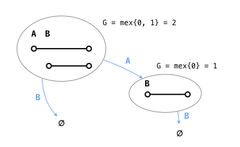
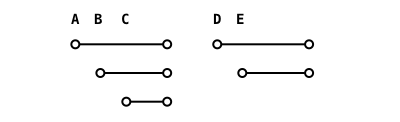
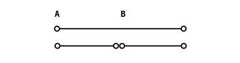
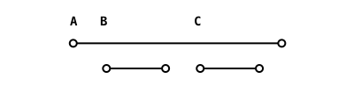
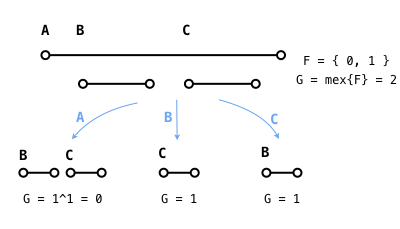
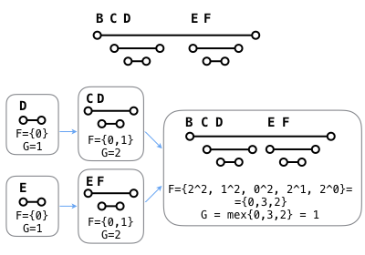
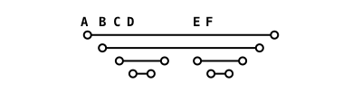

# Intervals

Oh boy, this was tough. I first tried to approach this problem with Minimax. But what seemed like a simple game with succinct rules on the surface turned out an insurmountable problem for Minimax. There are two complications in this game: first, the branching factor depends on the number of intervals, so for the largest test cases this was going to be a problem. But also representing the game state and playing moves efficiently looked like a daunting problem all by itself. Soon I realized that minimax was not going to cut it and that I needed to pull out heavier weaponry.

I went online looking for matchstick games and the likes or anything that resembled this particular game and all the cues I found lead me in the same direction: the game of Nim.

In Nim there are N piles of coins, pebbles, chickpeas or whatever and each player takes coins alternately, but only from one pile at a time. The player that empties the board wins in the normal version of the game. There is also a _misère_ version where the player that takes the last coin loses. I will focus on the normal Nim because that's the one that looks more like our game.

It turns out that Nim belongs to a specific type of combinatorial games called **impartial games**, where both players can do the same moves as opposed to **partisan games** like Chess or Go, where each player has its own set of pieces and moves.

It also turns out that every impartial game can be expressed as a game of Nim. But what is more interesting is that the initial game state alone determines wether the first player is going to win or lose provided both players play optimally. And the strategy is incredibly simple: just XOR (yes, binary XOR) all the numbers of coins on each pile together. If the result is 0, then the player who plays next will lose no matter what he does as long as the other player plays wisely. The winning player's strategy is to take a number of coins so that the XOR always stays 0 afterwards. As long as both players keep the XOR value swinging from 0 to !0 each turn, the winning player will always win and the losing player will always lose. 

Yes, how XORing all the numbers makes this work seems voodoo but play it a few times and you will convince yourself. And that's not even the shadiest area here, we will get into more soon. But first, I recommend reading this paper from the MIT. This is fundamental before attempting to write any code:

[Theory of Impartial Games](http://web.mit.edu/sp.268/www/nim.pdf)

It's also important to keep in mind the basic rules of all impartial games:

  1. From a losing position the board can only move to a winning position: if our Nim piles have a XOR value of 0, the next move will change its value to something different to 0.

  2. However, from a wining position we can choose to move to a losing position (XOR = 0), or to a different winning position. Of course, we will always want to give our opponent a losing position. Because of 1, they won't have any other option than giving us back a winning position.

The most useful piece of information in that PDF is the explanation of the Sprague-Grundy function. When applied on the game state graph, it will give us a number called Grundy number or Nimber, let's call it G. G = 0 if the board is in a lose position for the next player, whereas G != 0 if it's a win.

The function to obtain G for a given game state represented by a node in the graph is:

G(x) = _mex_ { G(y) : y ∈ F(x) }

Which, in plain english means "for all the game states that can be reached from game state x, get their Grundy number and find the _mex_ value of them all". Since it's a recursive function, it needs to start from the leaf nodes, which all have G = 1, and work all the way back up to the root.

The _mex_ function looked puzzling in the beginning, but it's actually very simple, it just means "the first integer >= 0 that is not present in the given set".

So, in this example:

The G number for the root state is:

G = _mex_ { 0, 1 }

which is 2 because that's the first integer >= 0 that is not in set { 0, 1 }.

Though this seems like we need to explode the whole state graph like with Minimax, it is actually not necessary if we use a DP approach working inductively from the leaf nodes up to the root.

The most simple case is something like:

This is just like the example above. It's also exactly equivalent to a Nim pile of 3, since we have the option to take 1, 2 or 3 intervals by picking integers A, B or C.

 
This is also a very Nim-like situation. We have the equivalent of two Nim piles of 3 and 2 intervals each. The G number of this board is G = 2 ^ 3 = 1. Note that player 1 can win the game by picking A, which leaves two piles of exactly 2 intervals each and thus G = 0 for the opponent. See the importance of the G number?

Things start to get a bit hairy here:

But because the top interval disappears no matter which of the bottom intervals we pick, this means that the top interval has no effect on the game whatsoever so we can just ignore it:

This works when there are no gaps among the children and it's exactly the same game as above (G = 1 ^ 1 = 0). This also means that the first player will lose and there's nothing he can do to help it.

Now, this is where things get a bit more complicated:

There are 3 moves we can do, which result in 3 follower game states:

  1. If we pick A, we are left with two separate Nim piles of G = 1 each, so the resutling Grundy number for this follower state would be G = 1 ^ 1 = 0.

  2. If we pick B, we only have one pile left, so we have another follower with G = 1.

  3. If we pick C, we only have one pile left, so last follower has G = 1.

Now the set of followers for our game's root state is F = { 0, 1 }, let's do G = _mex_ { 0, 1 } = 2 and that becomes the Grundy number of the above game.

In order to win the game, we would pick A because that makes G = 0 for the opponent. And I don't meant to say this was easy because it took me like 2 weeks to put this all together, but that's pretty much the secret to it!

There are some loose ends here and there. For example, the challenge also requires us to output our first winning move if there is one. To do that, we need to label the followers with the minimum integer value that leads to that move. In the example above, we would label follower 0 with integer _A_. Since our winning strategy is to make the Grundy number of this pile 0, we know that we have to pick integer _A_.

Here is a slightly more complicated example:

We start from the leaf intervals and work our way up to the root in preorder. For every new interval, it's followers are the result of doing the moves of all their children, plus the result of removing the interval itself, provided there is a gap among the children.

The general rule to calculate the Grundy number of an interval that has children below it is:

	If there is a gap among children:
		Add the Xor of all children's G numbers to F
	For every child (c):
		For every follower state of the child (f):
			Xor the G numbers of all other children
			Xor that value and f
			Add that result to the new set of followers (F)
	Grundy number G = mex(F)
	
Here is one last example:            

Can you work out the G number of this game and what would be the the winner move here? :)

